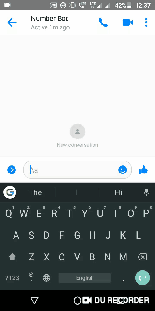
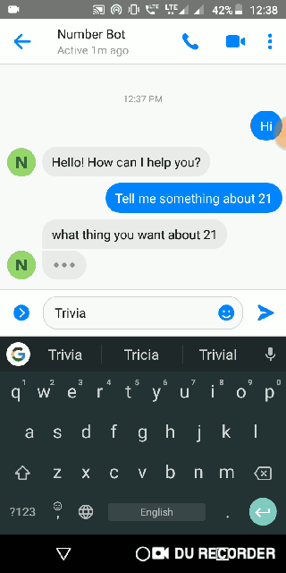
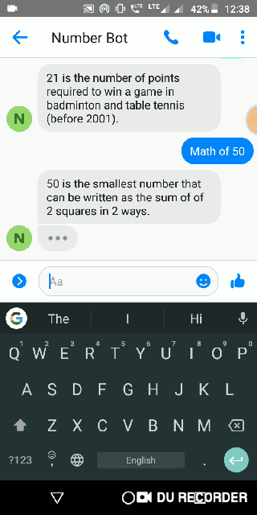

<h2 align=center> Number Bot</h2>
<div>

<br>

  >simple Facebook messenger bot using python and flask, playing with this is fun also gives some numbers facts and special meaning of those numbers. Have fun !
  
  -------------------------------
  <h4>Stack</h4>
  <ul>
  <li>Flask is used to create this bot </li>
  <li>this bot uses numbersapi to get trivia,math,year fact about number depends on user interaction</li>
 <li>Dialogflow is used for NLP and making chatbot</li>
 <li>Heroku to deploy at production environment</li>
 </ul>
</div>

-----------------------------------------------
<div align=center>
<h3>Number Bot on Messenger</h3>



  
</div>

-----------------------------------------------------------
### Installation

* Install dependencies
```sh
        $ pip3 install -r requirements.txt
```
